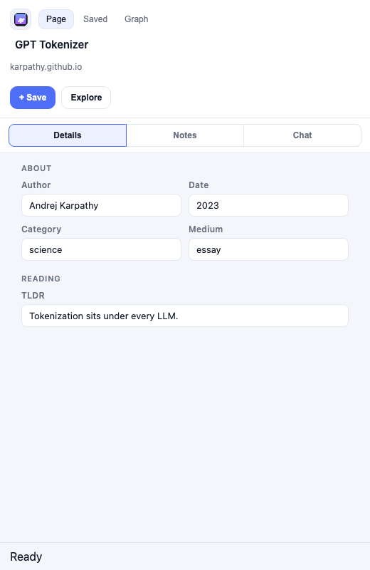
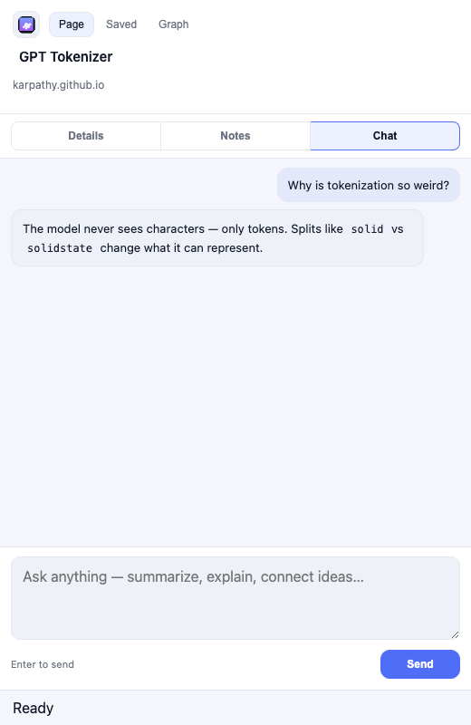
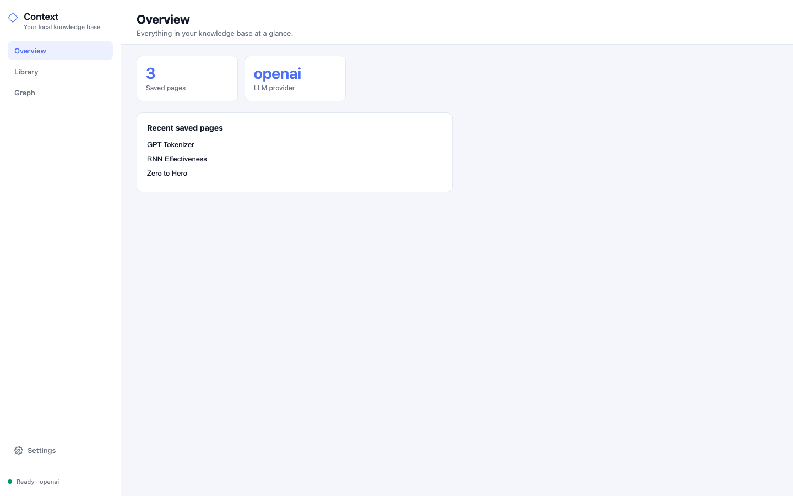
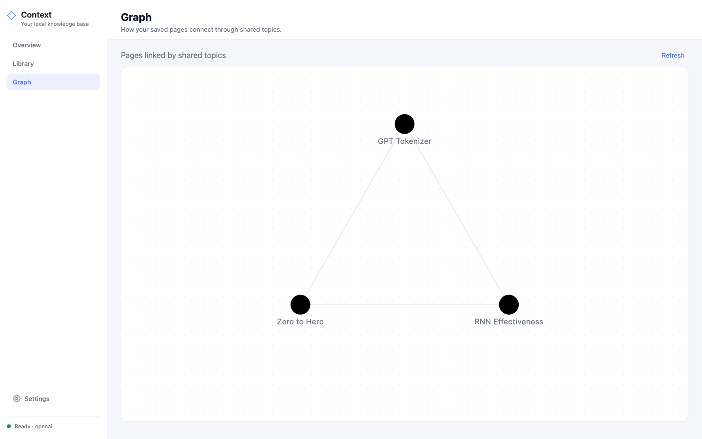
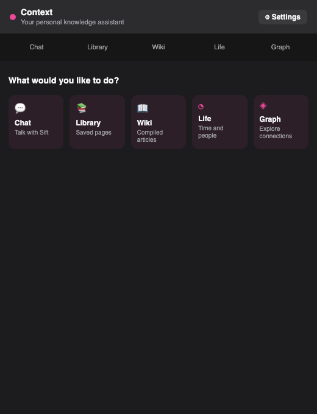
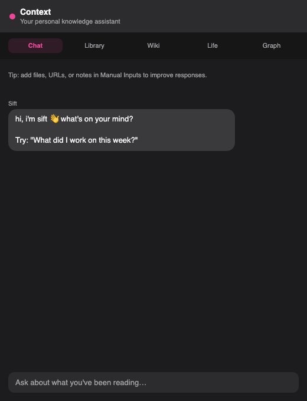

# Knowledge Bases / Context

Local-first personal knowledge system: highlight what you read, keep notes, chat over your own pages, graph how they connect.

Chrome extension + local dashboard + optional macOS app, one Python backend on `localhost:8765`. Data stays in `~/.kb/`. RAG via Ollama, or OpenAI if you set a key.

Inspired by [Karpathy’s knowledge-base post](https://x.com/karpathy/status/2039805659525644595?lang=en).

[Rebecca Joseph](https://github.com/rrebeccajoseph) & [Ramya Iyer](https://github.com/riyer8)

## How it fits together

```text
Chrome extension  ─┐
dashboard /app/   ─┼──►  python3 main.py :8765  ──►  ~/.kb/
Context.app       ─┘
```

Highlight → notes in the side panel → Copy JSON onto your site if you want. Chat and graph sit next to that. Life/Wiki are [archived from nav](docs/archived.md). Default LLM is Ollama; set `OPENAI_API_KEY` to use OpenAI.

## Visuals (More Features to be Explored!)

### Chrome extension

| Side panel | Chat |
|:---:|:---:|
|  |  |

### Dashboard


| Overview | Graph |
|:---:|:---:|
|  |  |

### macOS app

| Home | Chat |
|:---:|:---:|
|  |  |

## Setup

macOS, Python 3.11+, Chrome. Ollama **or** an OpenAI key.

```bash
cp .env.example .env          # fill what you use; file is gitignored
python3 -m pip install -r requirements.txt
python3 -m spacy download en_core_web_sm
python3 main.py               # curl http://127.0.0.1:8765/health
```

- Ollama: leave `OPENAI_API_KEY` empty; `ollama pull qwen2.5:3b` and `nomic-embed-text`.
- OpenAI: set the key; `KB_LLM_PROVIDER=auto` picks it up.

```bash
node scripts/install-launcher.mjs    # starts backend when the extension opens
```

Chrome → `chrome://extensions` → Load unpacked → `chrome-extension/`.

```bash
bash scripts/install_app.sh && open -a Context   # optional macOS app
```

Vars: `.env.example`. Walkthrough: [getting-started](docs/getting-started.md).

## Tests

```bash
pytest tests/
```

Two tests talk to a live LLM — they fail if that service isn’t up, the rest of the suite doesn’t:

- `test_gmail_sync_ingests_threads` — ingest still classifies via Ollama (or OpenAI if a key is in `.env`)
- `tests/test_llm_providers.py` — OpenAI provider path needs `OPENAI_API_KEY` (tests stub a dummy key; a real call needs network)

## Docs

[docs/](docs/README.md) · [architecture](docs/architecture.md) · [status](docs/status.md) · [API](docs/api.md)

Agents: [AGENTS.md](AGENTS.md) → [init.md](init.md)

## License

[MIT](LICENSE) © 2026 Ramya Iyer
